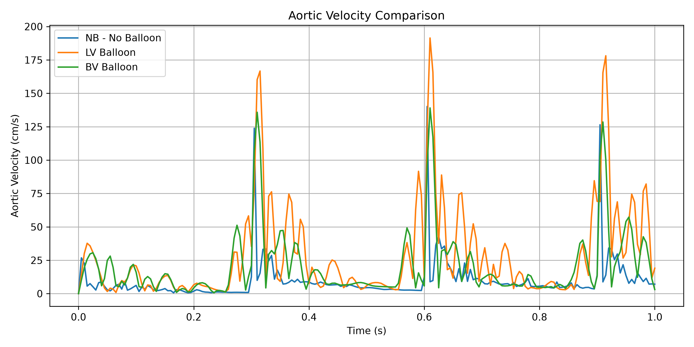
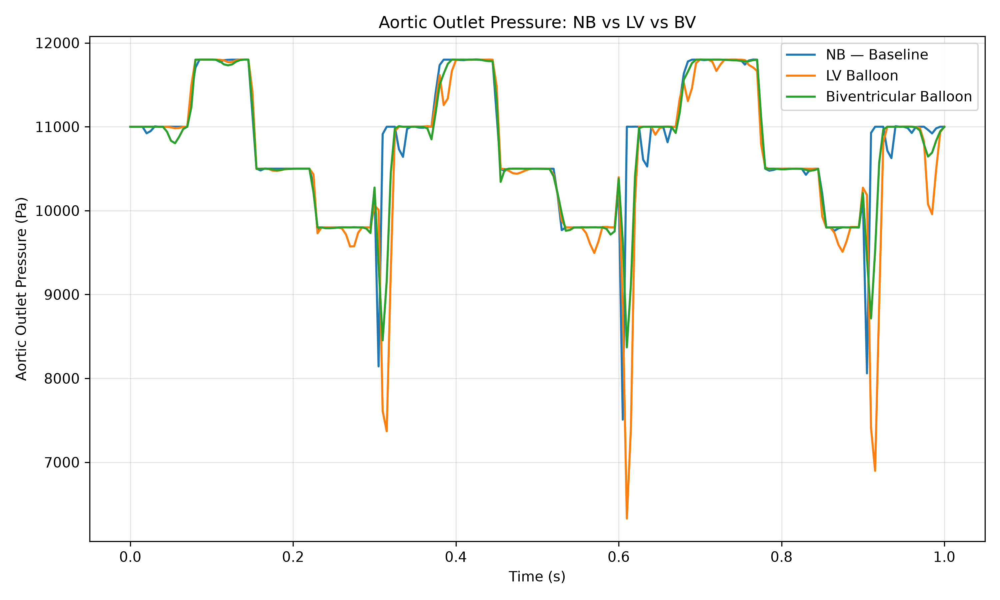
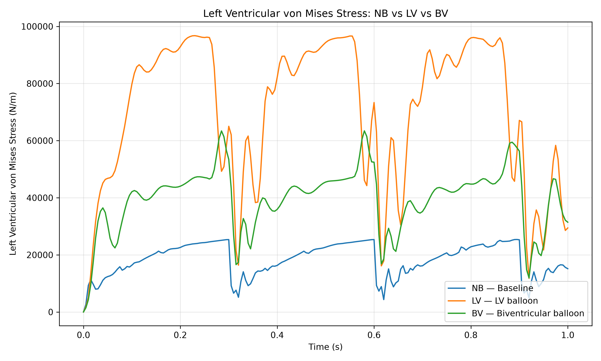
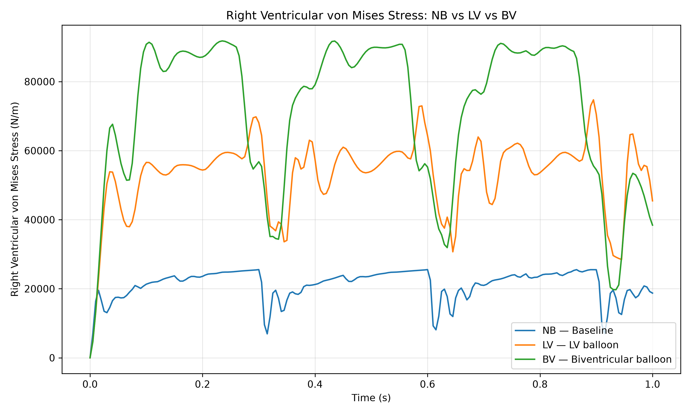
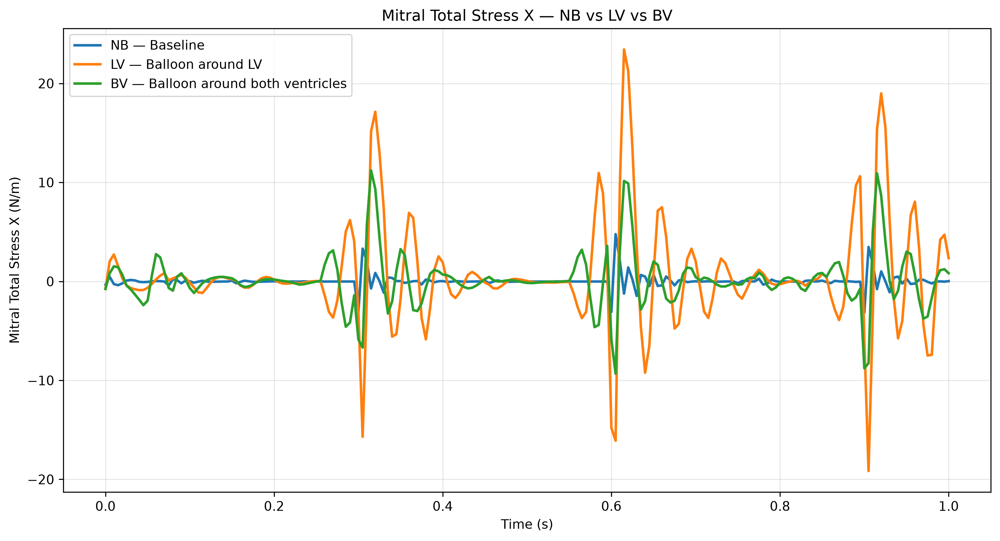
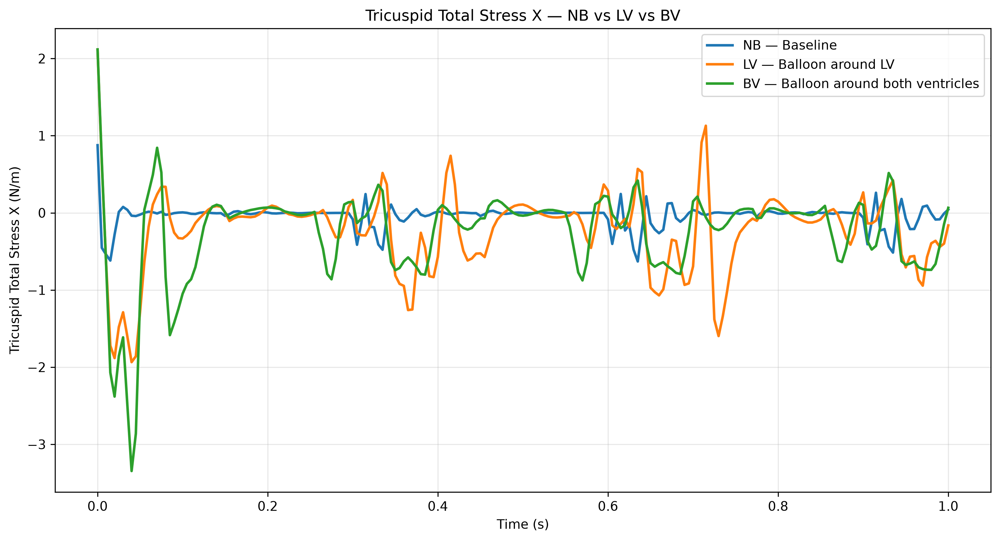

# Python-based Cardiovascular Hemodynamics Analysis of a Cardiac Assist Balloon

## Overview

This project presents a Python-based analysis pipeline for cardiovascular hemodynamics obtained from COMSOL Multiphysics simulations.

The project investigates the effect of an external cardiac assist balloon on ventricular hemodynamics using a coupled fluid–structure interaction (FSI) model.

## Simulation Cases

- **NB** — Healthy biventricular model without balloon
- **LV** — External compression of the left ventricle
- **BV** — External compression of both ventricles
## Research Questions

This project investigates how external cardiac assist balloon compression affects:

- Aortic and pulmonary blood flow velocity
- Aortic and pulmonary outlet pressure
- Left and right ventricular von Mises stress
- Mitral and tricuspid valve stress

The analysis compares two assisted configurations (LV and BV) against the healthy biventricular baseline (NB).
## Main Outputs

The analysis focuses on:

- Aortic and pulmonary outlet velocity
- Aortic and pulmonary outlet pressure
- Left and right ventricular von Mises stress
- Mitral and tricuspid stress
- Quantitative comparison between NB, LV, and BV configurations
## Key Figures

### Aortic Velocity

### Aortic Outlet Pressure

### Left Ventricular Von Mises Stress

### Right Ventricular Von Mises Stress

### Mitral Valve Stress

### Tricuspid Valve Stress

## Tools

- COMSOL Multiphysics
- Python
- NumPy
- Pandas
- Matplotlib
- CSV-based data processing

## Research Context

The underlying computational model was developed as part of cardiovascular biomechanics research investigating a blood-contact-free cardiac assist concept.

The Python pipeline is used to organize, process, and compare numerical simulation results.
## Methods

The computational workflow combines COMSOL Multiphysics simulation outputs with Python-based data processing and visualization.

### Research Workflow

1. **COMSOL Multiphysics simulation**
   - Fluid–structure interaction (FSI) modelling
   - Cardiovascular flow and structural mechanics
   - Three simulation configurations: NB, LV, and BV

2. **Data extraction**
   - Extraction of time-dependent pressure and velocity data
   - Extraction of ventricular von Mises stress
   - Extraction of mitral and tricuspid stress

3. **Python data processing**
   - Conversion of simulation outputs into structured CSV datasets
   - Numerical analysis using NumPy and Pandas
   - Calculation of mean, minimum, maximum, and relative changes

4. **Comparative analysis**
   - Quantitative comparison of LV and BV configurations against the NB baseline
   - Evaluation of hemodynamic and structural responses

5. **Visualization**
   - Generation of comparative figures using Matplotlib
   - Presentation of temporal simulation responses and key outcome metrics

### Computational Pipeline

COMSOL Simulation → Data Extraction → Python Processing → Quantitative Analysis → Visualization → Comparative Results

## Key Findings

The comparative analysis shows that balloon assistance substantially alters ventricular and valvular stress and flow velocity, while outlet pressures remain comparatively stable across the simulated configurations.

Compared with the baseline NB case:

- LV mean aortic velocity increased by approximately **188.5%**
- BV mean aortic velocity increased by approximately **105.4%**
- LV peak LV von Mises stress increased by approximately **281.1%**
- BV peak LV von Mises stress increased by approximately **149.8%**
- LV peak RV von Mises stress increased by approximately **192.5%**
- BV peak RV von Mises stress increased by approximately **259.3%**

These results represent numerical observations from the computational model and should not be interpreted as clinical outcomes.
## Results Summary

| Metric | NB | LV | BV |
|---|---:|---:|---:|
| Mean aortic velocity (cm/s) | 9.93 | 28.65 | 20.39 |
| Mean pulmonary velocity (cm/s) | 11.89 | 26.12 | 24.80 |
| Mean aortic pressure (Pa) | 10,781.05 | 10,646.59 | 10,731.97 |
| Mean pulmonary pressure (Pa) | 3,760.91 | 3,707.70 | 3,709.45 |
| Peak LV von Mises stress (N/m²) | 25,388 | 96,753 | 63,423 |
| Peak RV von Mises stress (N/m²) | 25,545 | 74,723 | 91,791 |
| Peak mitral stress (N/m) | 4.77 | 23.43 | 11.21 |
| Peak tricuspid stress (N/m) | 0.88 | 2.12 | 3.35 |

**NB:** Healthy biventricular model without balloon  
**LV:** External compression of the left ventricle  
**BV:** External compression of both ventricles

## Project Goals

1. Extract simulation data from COMSOL reports.
2. Convert raw numerical results into structured datasets.
3. Analyze temporal hemodynamic responses.
4. Compare different cardiac compression strategies.
5. Generate publication-quality figures.
6. Demonstrate reproducible computational biomechanics analysis.

## Project Structure

cardiovascular-hemodynamics/
├── data/
│   ├── raw/
│   │   └── COMSOL_Complete_Research_Database (2).md
│   └── processed/
├── src/
│   ├── data_processing.py
│   ├── extract_lv_von_mises.py
│   ├── extract_mitral_stress.py
│   ├── extract_rv_von_mises.py
│   └── extract_tricuspid_stress.py
├── analysis.py
├── dashboard.py
├── requirements.txt
└── README.md

## Reproducibility

The processed datasets are stored as CSV files, while the generated comparative figures are stored as PNG files.

The analysis scripts provide a reproducible workflow for processing and visualizing the simulation outputs.

## Status

The main COMSOL data extraction, processing, comparative analysis, and visualization stages are complete.

The project is currently organized as a reproducible computational biomechanics portfolio project.